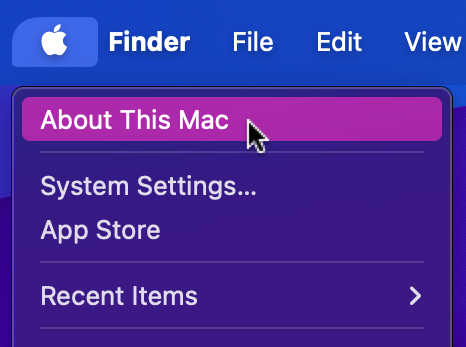

# Picking Your Mac

MultiSim is not officially supported on macOS, but it can be installed using a virtual machine or using Boot Camp. What method you choose will depend on the type of Mac you have at your disposal.

To identify your Mac, click on the Apple logo in the top left corner of your screen and select "About This Mac." This will show you the model of your Mac, which will help you determine which method to use to install MultiSim.

Look specifically at the "Model Name" and "Processor" fields to determine which method to use. If you have a Mac with an Intel processor, you can use Boot Camp to install MultiSim. If you have a Mac with an M1 processor, you will need to use a virtual machine to install MultiSim.
