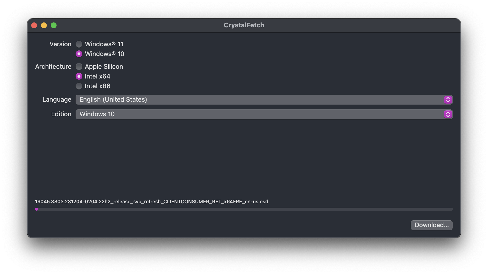
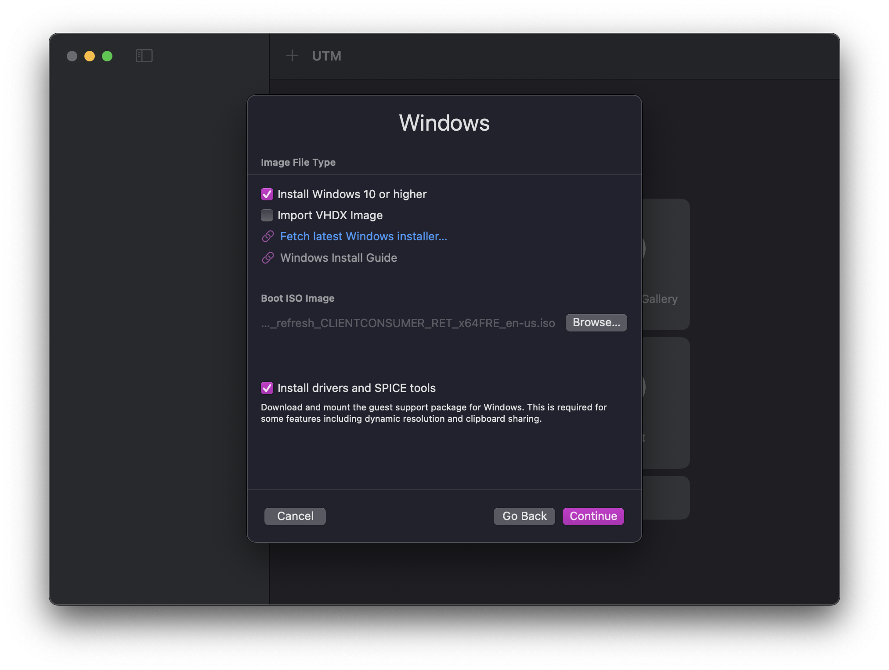
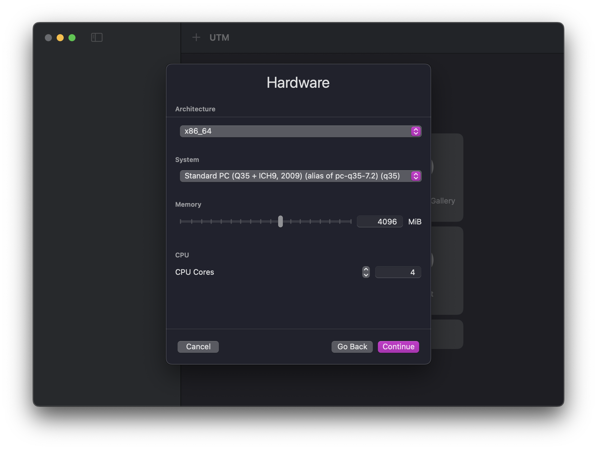

---
sidebar_position: 3
id: setup-vm
--- 

# Setting Up A Virtual Machine

## 1. Getting a Windows ISO

To install Windows on the virtual machine, you will need a Windows ISO file. You can skip this section if you already have a Windows ISO file.

1. Open the `CrystalFetch` app.
2. Select `Windows 10` from the list of versions
3. Select `Intel x64` from the list of architectures
4. Select any language you prefer, or leave it as default, which should be `English (United States)`
5. Press `Download...` to download the Windows ISO file
6. Select your preferred download location (your `Downloads` folder is probably the default and good enough) and press `Move`.

## 2. Creating the Virtual Machine

1. Open the `UTM` app.
   :::note
   When launching UTM for the first time, you may get a pop-up asking if you want to open it. Press `Open`. You may also get a "What's New" pop-up after it opens. Just press `Continue` to go to the next step.
   :::
2. Click on `Create New Virtual Machine`
3. Select `Emulate` and click `Windows`
4. Make sure these settings are selected:
   - `Install Windows 10 or higher` is checked
   - `Import VHDX Image` is unchecked
   - `Install drivers and SPICE tools` is checked
   
5. Press `Browse...` and select the Windows ISO file you downloaded earlier, then press `Continue`.
6. Select the following settings:
   - `Architecture`: `x86_64`
   - `System`: `Standard PC (Q35 + ICH9, 2009) (alias of pc-q35-7.2) (q35)`
   - `Memory`: `4096 MB` (4 GB) or more
   - `CPU Cores`: `4` or more

   
7. Press `Continue`. The default of 64GiB is fine for the disk size, but you can increase it if you want. Press `Continue` again.
8. If you wish to make a folder that is shared between macOS and your virtual machine, you can set it up here. Otherwise, press `Continue`.
9. Change the name of the virtual machine if you want, then press `Save`. Don't worry about the other settings.

## 3. Configuring the Virtual Machine

1. Click on the virtual machine you just created and press the configure button , which is next to the play button in the upper right corner.
2. Click on `System` in the left sidebar.
3. Enable `Force Multicore`.
4. Click on `Display` in the left sidebar.
5. Enable `Resize display to window size automatically`.
6. Scroll down in the left sidebar and look through the list of IDE drives. You should see three drives. Find the one that has its `Image Type` set to `Disk Image` and click on it.
7. Change the `Interface` to `NVMe`. This will make identifying the drive easier later.
8. Press `Save`.
9. Press `Command + ,` to open UTM settings.
10. Click `Display` in the top bar.
11. Change the `Renderer Backend` to `ANGLE (Metal)`.
12. Close the settings window.

## 4. Installing Windows

:::important
If you see "Windows Guest Support Tools" under `Pending` in your sideba
:::

1. Click on the virtual machine you created and press the play button in the upper right corner.
2. When the window pops up, spam any key on your keyboard to boot to the Windows installer.
3. Wait for the installer to load.
4. Follow the instructions to install Windows.
   - When asked for a product key, you can skip it by pressing `I don't have a product key`. We will activate Windows later.
   - Select `Windows 10 Pro N` when asked which version to install. We use the `N` edition because it has better privacy, but it doesn't really matter if you don't use the `N` edition.
   - When asked for a partition to install Windows on, there should be only one option in the list. Select it and press `Next`.
5. Wait for Windows to install. This will take a while.
6. The installer will restart the virtual machine.

## 5. Going Through Windows Setup

Wait for the Windows setup screen to show up. Setting up Windows is quite straightforward. Just follow the instructions on the screen. However, there are a few things to note:

1. Turn off WiFi after completing the Basics section. You can turn it back on after activating Windows.
2. If you get any errors that start with `OOBE`, just click `Skip`.
3. Deny all privacy settings. Any settings that ask for your location, microphone, camera, etc., should be denied.
4. When asked about Cortana, select `Not now`.
5. If you are asked to sign in with a Microsoft account, select `Offline account` and then `Limited experience`.

The setup for Windows 11 is slightly different though. To set up Windows 11, follow these steps:

1. Select your language and then your keyboard layout
2. Press `Shift + Fn + F10` to open Command Prompt
3. Type in `oobe\bypassnro`, press `Enter`, and wait for your computer to restart.
4. Continue through with setup, but:
   - Do not connect to the internet
   - Deny each option in the Privacy section
