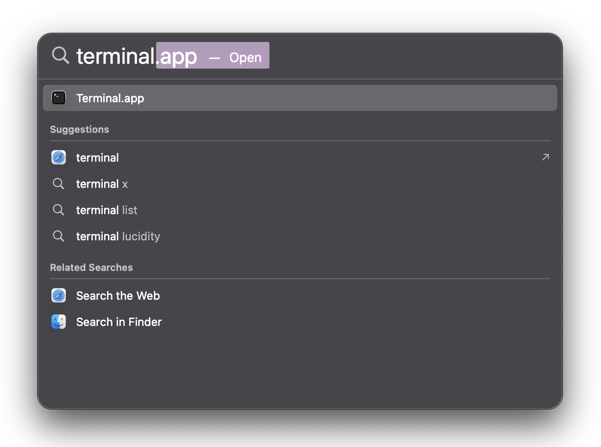

---
sidebar_position: 2
--- 

# Installing Prerequisites

Homebrew is a package manager for macOS that allows you to install software and apps easily. We will be using Homebrew to install the software required to set up the virtual machine.

## 1. Installing Homebrew

1. Open the `Terminal` app.
    :::tip
    Spotlight Search is a search feature on macOS that allows you to instantly find files, apps, and other items on your Mac.

    This guide involves a lot of different apps, so it's a good idea to get comfortable with using Spotlight Search to quickly open them.
    The shortcut to open Spotlight Search is `Command` + `Space`.
    :::
    :::note
    To use Spotlight Search to open the `Terminal` app, press `Command` + `Space` to open up Spotlight Search, type `Terminal`, and press `Return`.
    
    :::

2. Copy and paste the following command into the terminal and press `Return`:

    ```bash
    /bin/bash -c "$(curl -fsSL https://raw.githubusercontent.com/Homebrew/install/HEAD/install.sh)"
    ```

3. Follow the instructions in the terminal to complete the installation.
   1. Enter your password when prompted
   2. Press `Return` to confirm the installation location
   3. Wait for the installation to complete

## 2. Other Prerequisites

1. Close the Terminal window and open a new one.

    :::tip
    Press `Command` + `Q` to quit the Terminal app, then use Spotlight Search to open a new Terminal window. This works for most apps on macOS.
    :::

2. Run `brew --version` to verify that Homebrew is installed. If you see a version number, Homebrew is installed correctly and you can proceed. If you see an error message, please refer to the [Installing Homebrew](#1-installing-homebrew) section.
3. Copy and paste the following command into the terminal and press `Return`:

    ```bash
    brew install utm crystalfetch
    ```

4. Wait for the installation to complete.
