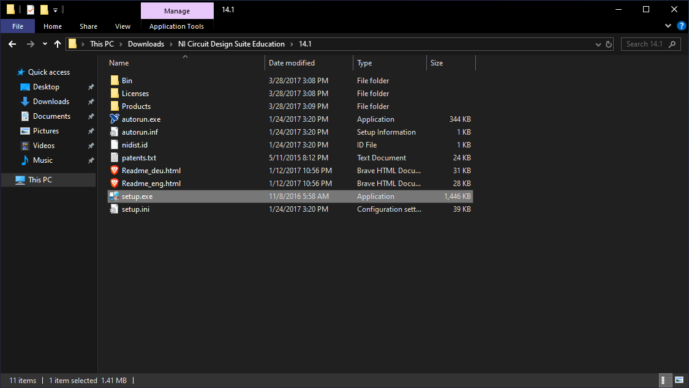
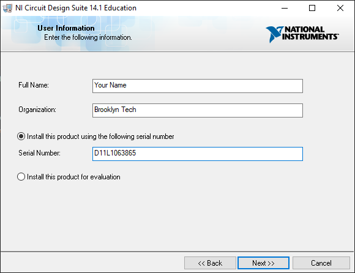
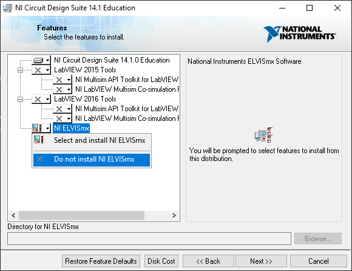

# Installing MultiSim

## 1. Making An NI Account

One of the requirements to download MultiSim is to have an NI Account. If you already have an NI account, you can skip this section. If you don't have an NI account, follow these steps to create one:

:::tip
If you're installing MultiSim in a virtual machine, do these steps in a browser outside of the virtual machine as it'll be easier.
:::

1. Go to the [National Instruments homepage](https://www.ni.com/en.html).
2. Press the account button , then press `Create an Account`.
3. Fill in the required information and press "Create Account". For `Role`, select `Student`. Use your own, personal, non-school email address.
  
4. Check your email for a verification email from NI. Click on the link in the email to verify your account and press `Continue`.

## 2. Downloading MultiSim

With a NI Account, you can now proceed with the installation process.

:::danger
This section is being actively modified. Instructions here may be incomplete and/ or not working.
:::

1. Open your browser and go to the [download link](https://s3.amazonaws.com/support-downloads.pltw.org/Installers/Digital+Electronics/NI+Circuit+Design+Suite+Education.zip) for  MultiSim.
2. Extract the contents of the zip file.
3. Open the extracted folder, click into `14.1`, then double-click `setup.exe`.
  
4. Launch the installer, wait for it to load, then press `Next`.
5. Type your name, enter `Brooklyn Tech` as the organization, enter `D11L1063865` as the serial number, then press `Next`.
  
6. Press `Next` until you reach the `Features` page. Here, click on the drop-down next to `NI ELVISmx` and select `Do not install NI ELVISmx`, then press `Next`.
  
7. Uncheck the box for `Search for important messages and updates`, then press `Next`.
8. Read and accept the license agreements, then press `Next`.
9. Wait for the installation to complete, then press `Finish`. This will take a while.
