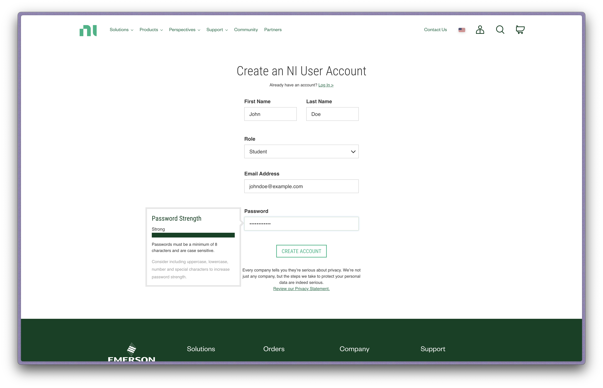
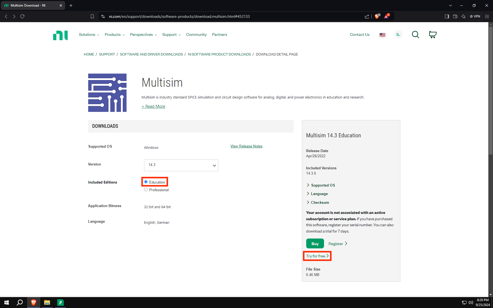
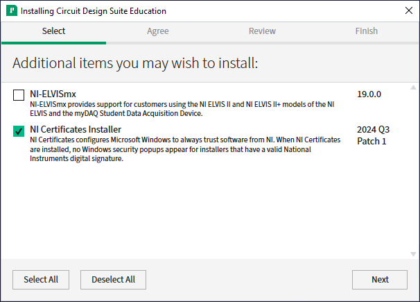

# Installing MultiSim

## 1. Making An NI Account

One of the requirements to download MultiSim is to have an NI Account. If you already have an NI account, you can skip this section. If you don't have an NI account, follow these steps to create one:

:::tip
If you're installing MultiSim in a virtual machine, do these steps in a browser outside of the virtual machine as it'll be easier.
:::

1. Go to the [National Instruments homepage](https://www.ni.com/en.html).
2. Press the account button , then press `Create an Account`.
3. Fill in the required information and press "Create Account". For `Role`, select `Student`. Use your own, personal, non-school email address.
  
4. Check your email for a verification email from NI. Click on the link in the email to verify your account and press `Continue`.

## 2. Downloading MultiSim

With a NI Account, you can now install MultiSim on your machine:

1. Open your browser and go to the [download page](https://www.ni.com/en-us/support/downloads/software-products/download.multisim.html#369660) for MultiSim.
2. Log in to your NI account, then return to the download page and click `Try for free`. We will activate MultiSim later.
    
3. Launch the installer and follow the instructions to install MultiSim.
    - When prompted to enable the NI Update Service, select `Yes`.
    :::tip
    When you get to the `Installing Circuit Design Suite` screen, select `NI Certificates Installer`. This will make installing other NI software easier later.
    
    :::
4. Close the activation window that pops up after the installation is complete, then press the `Restart Now` button in the installer.
