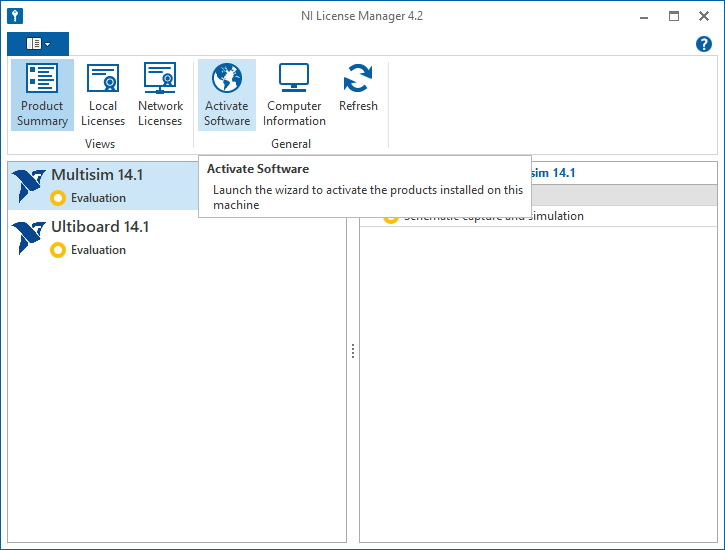
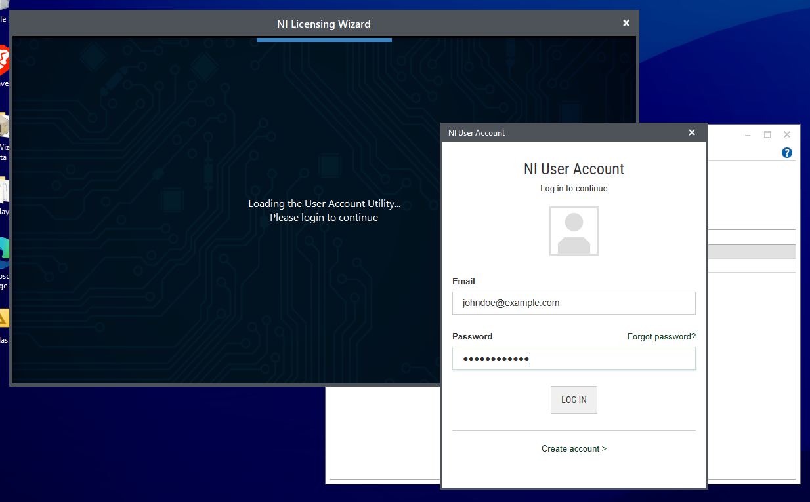
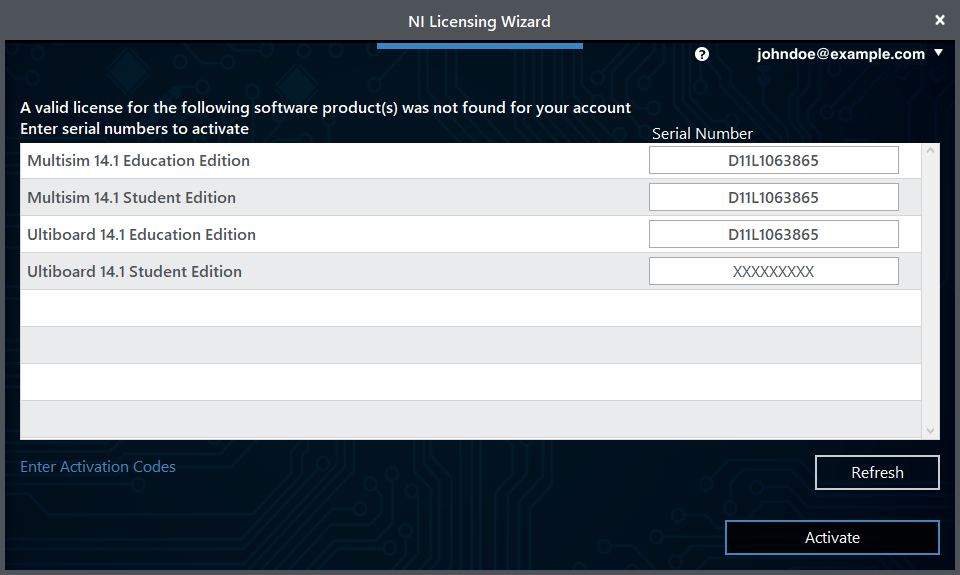
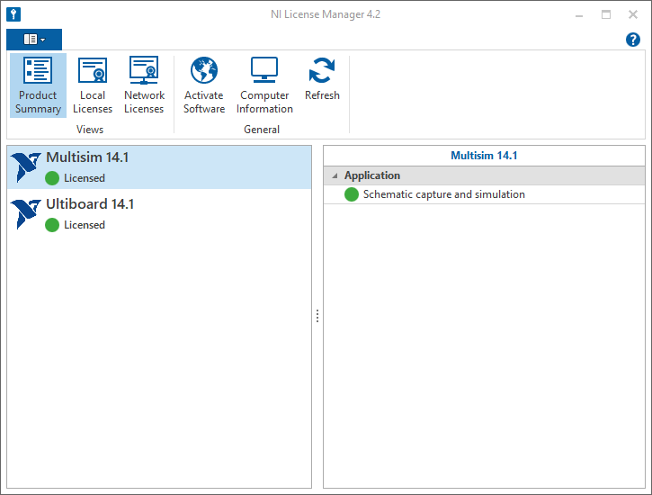

# Activating MultiSim

1. Launch the NI License Manager. You can do this by searching for it in the Start Menu, or by looking in the `National Instruments` folder in the Start Menu.
2. Press `Activate Software`.
    
3. Log in with your NI Account. If you don't have an account, you can create one [here](https://www.ni.com/en.html).
    
4. Press `Activate`. If you get an error regarding the Student Edition, press `Cancel`.
    
5. After finishing the activation process, you should see that both MultiSim and Ultiboard are activated. This means you're all set! You can now close the NI License Manager.
    
